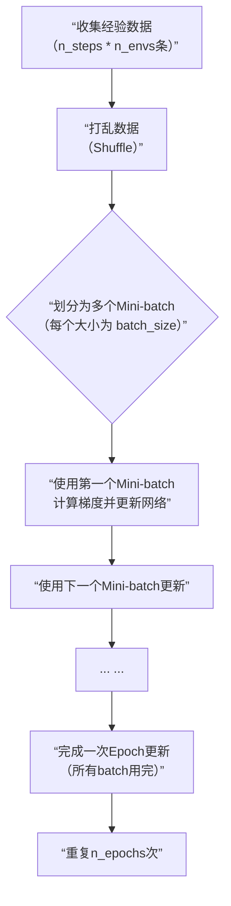

# 超参数含义解释

本文旨在尽可能详细地解释各超参数的含义。

[TOC]

## 训练超参数

### n_envs

并行环境的数量，也就是同时跑多少个环境实例来采样数据。值越大，采样效率通常更高，但会占用更多 CPU/GPU 和内存资源。

### out_dir

训练输出目录，用于保存模型、日志等。

### checkpoint_path

继续训练时加载的已有模型权重路径。

### seed

随机种子，保证可复现实验结果。

### policy

使用的策略网络类型/类名（自定义策略）。

### policy_kwargs

传给策略网络的额外参数。

### $\lambda$

广义优势估计（GAE）中的λ参数是PPO算法中控制**偏差-方差权衡**的关键超参数，它通过给不同步长的优势估计分配权重，平衡**短期估计的稳定性**与**长期估计的准确性**。

下面我们通过一个对比表格来直观理解λ取不同值时的特点，然后再深入讲解其工作机制。

| λ取值        | 估计方法特性                                 | 偏差-方差特性      | 适用场景                                     |
| :----------- | :------------------------------------------- | :----------------- | :------------------------------------------- |
| **λ=0**      | 纯**时序差分（TD）**，只看下一步奖励         | **高偏差**，低方差 | 环境随机性大、需要快速稳定训练时             |
| **λ=1**      | 纯**蒙特卡洛（MC）**，考虑整个轨迹的累积奖励 | 低偏差，**高方差** | 环境确定性高、轨迹回报能够准确衡量长期收益时 |
| **0.9-0.99** | **平衡折中**，多步TD误差的指数加权平均       | 偏差方差均衡       | 大多数实践场景，追求稳定且高效的学习         |

#### λ参数的工作机制

λ参数的核心作用像一个**时间衰减权重**，决定了在估计某个时刻动作的“优势”时，我们应该在多大程度上信任后续的预测。

广义优势估计（GAE）的公式可以理解为一系列TD误差的加权和：
$$
A_{t}^{GAE} = \sum_{l=0}^{\infty} (\gamma \lambda)^l \delta_{t+l}
$$
其中，\(\delta_t = r_t + \gamma V(s_{t+1}) - V(s_t)\) 是第t步的TD误差，衡量了当前价值估计的意外程度。

*   **当λ较小时**（如接近0），公式中\((\gamma \lambda)^l\)衰减得非常快，这意味着**近期**的TD误差（如\(\delta_t\)）占据了极大权重。此时的优势估计主要依赖于价值函数V的预测，虽然方差小、训练稳定，但价值函数本身可能不准确，因此会带来较高的**偏差**。
*   **当λ较大时**（如接近1），权重衰减得很慢，**远期**的奖励信号也能对优势估计产生重要影响。这减少了对价值函数V的依赖，更多地依据实际获得的回报，因此**偏差较低**。但遥远的未来充满不确定性，这使得估计的**方差增大**，训练过程可能变得不稳定。

在实际计算中，我们通常使用从后往前的递归方式，这使得GAE的实现非常高效：
$$
A_t = \delta_t + \gamma \lambda A_{t+1}
$$

#### λ参数如何影响PPO训练

在PPO算法中，策略的更新方向直接由优势函数$A_t$指导。λ的取值通过影响$A_t$的质量，进而决定了PPO训练的稳定性和效率。

1.  **λ与策略更新稳定性**：一个方差小的优势估计（λ偏小）能让策略更新更加**平滑稳定**，避免因单次“幸运”或“不幸”的轨迹导致策略剧烈波动。PPO本身采用的Clipping机制也是为了约束策略更新幅度，与GAE中通过λ控制优势估计质量相辅相成，共同提升训练稳定性。
2.  **λ与数据利用效率**：λ参数也影响了**信用分配**的粒度。合适的λ值能更准确地将长期结果归因到前期关键决策上，从而更有效地利用数据，提升学习效率。

### total_timesteps

####  核心定义

`total_timesteps`指的是在整个强化学习训练过程中，智能体**计划与环境进行交互的总次数**。每一次交互称为一个“时间步”（timestep），它包含一个完整的“观察-决策-行动-反馈”循环：

1. **观察**：智能体从环境获取当前状态。
2. **决策**：智能体基于当前策略（策略网络）选择一个动作。
3. **行动**：智能体将动作执行于环境中。
4. **反馈**：环境转换到新的状态，并给予智能体一个奖励信号。

这个循环执行一次，就是 **1 个时间步**。`total_timesteps`就是设定这个循环要执行的总次数。

#### 角色与重要性

可以将 `total_timesteps`理解为智能体的 **“总学习时长”** 或 **“总训练预算”**。它直接决定了智能体能够获得多少经验数据，进而决定了策略能够被优化到何种程度。

- **设置过低**：如果 `total_timesteps`太小，意味着智能体“还没练习够”训练就被迫停止了。它没有足够的数据来理解环境的复杂性和任务的目标，最终学到的策略往往表现不佳（欠拟合）。
- **设置过高**：如果 `total_timesteps`太大，虽然智能体有可能学到更优的策略，但会带来两个问题：
  -  **计算资源浪费**：策略可能早已收敛到最优解附近，后续的训练收益很小，却仍在消耗大量的计算时间和电力。
  -  **过拟合风险**：在某些情况下，智能体可能会过度适应训练环境的特定随机性，反而降低了其在新环境或测试环境中的泛化能力。

因此，设定一个合适的 `total_timesteps`是在训练效果和训练成本之间取得平衡的关键。

#### 与其他参数的关系

`total_timesteps`并非孤立存在，它与其他训练参数共同决定了训练的进程：

- **与 `n_steps`和 `n_envs`的关系**：在PPO等算法中，我们通常使用并行环境（`n_envs`）来加速数据采集。每个环境在每次数据收集阶段会连续运行 `n_steps`步。那么，完成一次数据收集，总共就得到了 `n_envs * n_steps`个时间步的经验数据。`total_timesteps`决定了这样的数据收集循环需要进行多少次。
- **与 `n_epochs`的关系**：在每次收集到一批数据后，算法会利用这批数据对模型进行多次（`n_epochs`次）更新。`total_timesteps`决定了总共有多少批数据会被用于这样的“收集-更新”循环.

### learning_rate

学习率，在Stable-Baselines3的PPO实现中，默认actor与critic使用同一学习率。

### entropy coefficient

**熵系数（entropy coefficient）**，是PPO以及其他很多策略梯度算法中一个非常重要的超参数，它直接用于**鼓励智能体进行探索**。

#### 核心概念：策略的熵（Entropy）

要理解 `ent_coef`，首先要明白什么是策略的**熵**。

*   **策略**：可以看作是智能体在给定状态下选择各个动作的概率分布。
*   **策略的熵**：是衡量这个概率分布**随机性**或**不确定性**的数学指标。
    *   **高熵**：表示策略很“不确定”或“犹豫不决”。例如，在一个有4个动作的状态下，策略为 `[0.25, 0.25, 0.25, 0.25]`（每个动作概率均等），此时熵值最高。这意味着智能体的行为非常随机，**探索性很强**。
    *   **低熵**：表示策略很“确定”或“自信”。例如，策略为 `[0.9, 0.05, 0.03, 0.02]`，它极度倾向于选择第一个动作。这意味着智能体的行为几乎确定，**利用性很强**。

#### `ent_coef` 的作用机制

`ent_coef` 作为一个系数，会与策略的熵值相乘，构成一个**熵奖励（entropy bonus）**，并加入到PPO的总损失函数中。

**损失函数 ≈ 策略损失（Actor Loss） - 熵奖励（Entropy Bonus）**

由于在优化中我们通常是最小化损失函数，而这里是从损失中**减去**熵奖励，其实际效果是：

**最大化总奖励 ≈ 最大化累积环境奖励 + 最大化策略的熵**

这意味着，算法在学习如何获得更高环境回报的同时，**也被鼓励去保持策略的一定随机性**。

#### 为什么需要熵奖励？——探索与利用的权衡

如果没有熵奖励，智能体很容易过早地“固执己见”。

*   **问题**：在训练初期，智能体可能偶然发现某个动作带来了一点正奖励，它就会迅速增大选择该动作的概率，而忽略对其他可能更好动作的探索。这会导致策略迅速收敛到一个**局部最优解**，而非全局最优。
*   **解决**：通过引入熵奖励，算法会“惩罚”那些过于确定的策略。智能体为了获得额外的熵奖励，会主动保持策略的随机性，从而继续探索不同的动作，有更大机会发现更好的策略。

#### 调整 `ent_coef` 的影响

*   **`ent_coef` 设置过大**：
    *   **优点**：探索性非常强，智能体不会轻易放过任何尝试新动作的机会。
    *   **缺点**：可能“探索过度”，智能体过于随机，无法专注于利用已知的有效动作，导致学习速度缓慢甚至无法收敛。就像一个总在尝试新路而从不固定走一条最快路线的探险家。
*   **`ent_coef` 设置过小或为 0**：
    *   **优点**：一旦找到有效策略，会快速利用，初期学习曲线可能很陡峭。
    *   **缺点**：探索不足，极易过早陷入局部最优。就像一个探险家发现第一条能到达终点的路后就再也不尝试其他可能更快的路径了。

### batch_size

`batch_size`（批处理大小）是深度学习中的一个基础但至关重要的超参数。在PPO算法中，它特指在每次模型参数更新时，**用于计算梯度的一次性处理的经验数据（状态-动作对）的数量**。

为了更直观地理解它与相关参数的关系及其在训练流程中的位置，我们可以参考下面的PPO训练数据流示意图：

#### 核心概念与工作流程

结合上图，我们来理解它的工作流程：

1.  **数据收集**：智能体在多个并行环境（`n_envs`）中分别运行一定步数（`n_steps`），共收集 `n_envs * n_steps` 条经验数据，构成一个“经验池”。
2.  **批处理划分**：在模型更新阶段，会先将这个经验池的数据**随机打乱**，然后分割成若干个更小的、大小固定的集合，每个集合就是一个 **Mini-batch**，其包含的数据条数就是 `batch_size`。
3.  **迭代更新**：PPO算法会进行多轮（`n_epochs`）更新。在每一轮（Epoch）中，会按顺序使用每一个Mini-batch的数据来计算策略损失和价值损失的梯度，并更新网络参数。

#### 调整 `batch_size` 的影响

`batch_size` 的大小直接影响梯度估计的准确性和训练过程的稳定性，其核心是**偏差-方差权衡**和**计算效率**的权衡。

*   **`batch_size` 设置过小：
    *   **优点**：计算速度快，单次更新所需内存少。由于每次更新只基于少量数据，梯度噪声较大，这可能有助于模型跳出尖锐的局部最小值，有潜力找到更好的泛化解。
    *   **缺点**：梯度的**方差大**，估计不准确。导致训练过程**不稳定**，损失和奖励曲线波动剧烈，收敛性难以保证。
*   **`batch_size` 设置过大）**：
    *   **优点**：梯度的**方差小**，估计更准确。训练过程更**平滑稳定**，收敛曲线更平滑，更容易收敛。
    *   **缺点**：单次更新计算开销大，对内存要求高。而且，过于“平滑”的梯度可能使优化过程陷入平坦的局部最小值，泛化性能可能下降。

#### 与其他参数的关系

*   **与 `n_steps` 和 `n_envs` 的关系**：`batch_size` 必须小于或等于总的经验池大小，即 `n_envs * n_steps`。通常，总的经验池大小是 `batch_size` 的整数倍，这样才能均匀地划分Mini-batches。
*   **与 `n_epochs` 的关系**：`n_epochs` 决定了同一批经验数据被重复利用的次数。`batch_size` 越小，每个Epoch中的更新次数就越多，对数据的利用更“精细”，但也可能因更新次数过多而在陈旧的数据上过拟合。

### n_epochs

`n_epochs`（迭代轮数）是PPO算法中控制**数据复用效率**的关键超参数。它定义了在每次收集完一批新的经验数据后，**使用同一批数据重复进行模型参数更新的次数**。

#### 核心概念与工作流程

1. **数据收集**：智能体在环境中交互，收集一定数量的经验数据（比如 `n_steps * n_envs`条）。
2. **多轮迭代更新**：PPO不会只使用这批数据更新一次模型就将其丢弃。相反，它会将这**同一批数据**进行打乱，并重复使用 `n_epochs`次。在每一轮（Epoch）中，数据会被分成多个小批量（Mini-batches），用于计算梯度并更新策略网络（Actor）和价值网络（Critic）的参数。
3. **重新收集数据**：在完成了 `n_epochs`轮更新后，算法会丢弃这批“旧”数据，让智能体根据**更新后的策略**重新与环境交互，收集新的经验数据，然后重复步骤2。

#### 调整 `n_epochs`的影响

`n_epochs`的核心作用是**平衡“数据利用效率”和“过拟合风险”**。

- **`n_epochs`设置过小**： 
  - **优点**：**更新速度快**，能快速切换到基于新策略收集的数据，对最新策略的反馈更及时。
  - **缺点**：**数据利用不充分**。每批经验数据只学习一次就被丢弃，可能导致学习速度慢，样本效率低下。智能体可能无法从宝贵的成功经验中充分提取信息。
- **`n_epochs`设置过大**： 
  - **优点**：**样本效率高**，充分挖掘每批数据的价值，尤其在数据收集成本高的环境中优势明显。
  -  **缺点**：**过拟合风险高**。模型可能对当前这批有限的、带有噪声的经验数据“过度优化”，导致学到的策略过于特化，反而破坏了学习的稳定性。同时，计算成本也会增加。

#### 与其他参数的关系

`n_epochs`的效果与其他参数相互影响：

- **与 `batch_size`**：在总数据量固定的情况下，`n_epochs`决定了参数更新的总次数（`n_epochs * (总样本数 / batch_size)`）。`batch_size`越小，每个Epoch中的更新次数越多，`n_epochs`的影响就越需要谨慎评估。
- **与PPO-Clip机制**：PPO的Clip机制是能与较大的 `n_epochs`协同工作的关键。它通过限制每次更新的步长，防止模型在多个Epoch的更新中因“过度学习”当前批数据而偏离旧策略太远，从而在一定程度上 mitigates（缓解）过拟合风险。

### $\gamma$

γ 被称为**折扣因子** 或**折扣率**，它是强化学习中最核心的概念之一，直接决定了智能体如何看待**近期奖励**与**远期奖励**的权重。

#### 核心定义与直观理解

γ 是一个介于 0 和 1 之间的数（通常非常接近 1，如 `0.99`）。它的核心作用是：**对未来获得的奖励进行打折**。

智能体的目标是最大化**累积奖励**，而这个累积奖励不是简单的未来所有奖励之和，而是**折扣后的累积奖励**，其计算公式为：
`G_t = R_{t+1} + γ * R_{t+2} + γ² * R_{t+3} + γ³ * R_{t+4} + ...`

#### 调整 γ 值的影响

γ 的取值大小，直接塑造了智能体的“眼光”是短浅还是长远。

| γ 取值                  | 智能体类型   | 行为特点                                                     | 优点与缺点                                                   |
| :---------------------- | :----------- | :----------------------------------------------------------- | :----------------------------------------------------------- |
| **γ = 0**               | **极端短视** | 只关心**下一步**的即时奖励 `R_{t+1}`，完全忽略之后的所有奖励。 | **优点**：只关注确定性的即时回报，学习目标非常明确简单。**缺点**：无法学习需要长期规划才能获得回报的任务。 |
| **γ 接近 1（如 0.99）** | **有远见**   | 会认真考虑**未来很长一段时间**的奖励。未来的奖励衰减得很慢。 | **优点**：能够为长期目标进行规划和牺牲短期利益。**缺点**：学习速度可能更慢，因为需要评估更复杂的未来状态；如果任务本身就很短，可能引入不必要的复杂性。 |
| **γ 较小（如 0.9）**    | **短视**     | 主要关注近期奖励，距离当前步数超过10步的奖励其影响力就微乎其微了 `(0.9^10 ≈ 0.35)`。 | **优点**：在不需要长远规划的简单任务中可能收敛更快。**缺点**：在需要长期规划的任务中会失败。 |

#### 与其他参数的关系

*   **与价值函数**：γ 是状态价值函数 `V(s)` 和动作价值函数 `Q(s, a)` 定义的一部分，这些函数都表示对未来折扣累积奖励的期望。
*   **与探索**：一个具有长远眼光的智能体（γ 高）更有可能进行“深度的”探索，因为它相信探索未知区域可能在未来带来高回报。

### n_steps

`n_steps`（每个环境的采样步数）是PPO算法中控制**数据收集阶段**的关键超参数。它定义了在每次模型更新周期开始时，**每个并行环境（env）需要独立运行多少步**，以收集经验数据。

#### 核心概念与工作流程

1.  **并行数据收集**：PPO算法会启动多个并行环境（数量由 `n_envs` 指定）。在每个环境中，智能体使用**当前最新的策略**与环境交互。
2.  **固定步数采样**：每个环境都会**独立地、连续地**运行 `n_steps` 步。在这期间，它会收集每一步的状态、动作、奖励、下一个状态等信息。
3.  **构成经验池**：当所有并行环境都完成了 `n_steps` 步的交互后，算法就收集到了总共 `n_envs * n_steps` 条经验数据。这个数据集合构成了本次模型更新的**经验池**。
4.  **模型更新**：PPO算法会利用这个经验池，进行多轮（`n_epochs`）的梯度更新来优化策略网络（Actor）和价值网络（Critic）。

#### 调整 `n_steps` 的影响

`n_steps` 的大小直接影响所收集数据的**批量大小**和**策略更新的延迟**，其核心是**数据新鲜度**与**梯度估计稳定性**之间的权衡。

*   **`n_steps` 设置过小（如 128-512）**：
    *   **优点**：策略更新频率高，智能体能很快地根据最新收集到的数据调整策略，对策略变化的响应更及时，数据**新鲜度**高。
    *   **缺点**：每次更新所基于的经验池较小（`n_envs * n_steps` 小），梯度估计的**方差较大**，可能导致训练过程不稳定。同时，频繁更新增加了计算开销。
*   **`n_steps` 设置过大（如 4096-8192）**：
    *   **优点**：每次更新基于更大的经验池，梯度估计更**稳定**，训练曲线可能更平滑。
    *   **缺点**：策略更新频率低，**延迟高**。在收集数据的漫长过程中，策略一直保持不变，当最终用这批“过时”数据更新时，当前策略可能已经与收集数据时的策略有较大差异，这会影响学习的效率。

#### 与其他参数的关系

`n_steps` 的效果与其他参数相互影响，需要协同设置：

*   **与 `n_envs`（并行环境数）**：这两个参数共同决定了经验池的总大小 **`batch_size_total = n_envs * n_steps`**。通常，这个总批次大小会远大于每次更新时使用的 `batch_size`（Mini-batch大小）。
*   **与 `batch_size`（Mini-batch大小）**：在PPO更新阶段，经验池会被打乱并分成多个Mini-batch。`n_steps` 和 `n_envs` 决定了总数据量，而 `batch_size` 决定了每个小批次的大小。
*   **与 `n_epochs`（更新轮数）**：`n_epochs` 决定了同一批经验数据会被重复利用多少次。如果 `n_steps` 很大，意味着每批数据量很大，进行多轮更新时，模型可能会在这批固定的数据上“过拟合”。

### $\epsilon$(clip_range)

好的，我们来详细解释PPO算法中 **`clip_range`** 这个参数的**普遍性含义**。

`clip_range`（裁剪范围），也常被称为 **ε**，是PPO算法最核心、最具标志性的超参数。它直接实现了PPO的全称——“**近端策略优化**”中的“**近端**”二字，其核心作用是**强制限制每次策略更新的步长，从而确保训练过程的稳定性**。

#### 核心思想：信任区域

要理解 `clip_range`，首先要明白它要解决的问题。在强化学习中，我们根据**旧策略**收集的经验数据来更新**新策略**。这是一个**异策略**学习的场景。如果新策略相对旧策略更新得太快、变化太大，那么之前收集的经验数据就变得不适用于评估新策略了，这会导致策略更新沿着一个错误的方向进行，最终引起训练崩溃（性能急剧下降）。

PPO的想法是：我们应该待在旧策略附近的一个小范围内进行优化，这个范围就叫做**信任区域**。而 `clip_range` 就是这个信任区域的**边界**。

#### 工作机制：裁剪替代目标

`clip_range` 的工作机制体现在其著名的**裁剪替代目标函数**中。我们来分解一下这个过程：

1.  **计算概率比**：首先，计算新策略与旧策略在选择某个特定动作上的概率之比，称为 **比率**。
    `ratio = π_new(a|s) / π_old(a|s)`
    *   `ratio > 1`：新策略更倾向于该动作。
    *   `ratio < 1`：新策略不太倾向于该动作。

2.  **应用裁剪**：PPO的损失函数会同时计算两个值：
    *   **未裁剪目标**：`surr1 = ratio * A_t` （`A_t` 是优势函数）
    *   **裁剪后目标**：`surr2 = clip(ratio, 1 - ε, 1 + ε) * A_t`
    这里的 **`ε`** 就是 **`clip_range`**。`clip` 函数将 `ratio` 限制在 `[1 - ε, 1 + ε]` 的区间内。

3.  **取最小值**：最终的策略损失是取这两个目标的最小值：
    `actor_loss = -min(surr1, surr2)`

这个 `min` 操作是PPO的精髓，它的作用是：

*   **当优势函数 `A_t` 为正时**（即该动作被认为是好的）：
    *   我们希望增加选择该动作的概率（即希望 `ratio` 越大越好）。
    *   但PPO会限制 `ratio` 最大不能超过 `1 + ε`。这防止了新策略因为某个动作一时表现好就过度依赖它，避免了“矫枉过正”。

*   **当优势函数 `A_t` 为负时**（即该动作被认为是坏的）：
    *   我们希望减少选择该动作的概率（即希望 `ratio` 越小越好）。
    *   但PPO会限制 `ratio` 最小不能低于 `1 - ε`。这防止了新策略因为某个动作一时表现差就完全摒弃它，保留了其未来被探索的可能性。

#### 调整 `clip_range` 的影响

`clip_range` 的取值直接控制了策略更新的“保守”程度。

*   **`clip_range` 设置过大**：
    
    *   **优点**：允许策略在单次更新中发生较大变化，在相对平坦的优化环境中可能收敛更快。
    *   **缺点**：**信任区域过大**，失去了对策略突变的约束力，训练过程可能变得不稳定，重蹈传统策略梯度算法易崩溃的覆辙。
    
*   **`clip_range` 设置过小**：
    
    *   **优点**：更新非常**保守和稳定**，几乎不可能发生训练崩溃。
    *   **缺点**：策略更新得像“蜗牛”一样慢，学习效率极低，可能需要极长的训练时间才能收敛。
    
    

### value function coefficient

`vf_coef`，全称为 **价值函数系数（value function coefficient）**，是PPO算法总损失函数中用于**平衡策略优化目标与价值函数估计目标相对权重的超参数**。

#### 核心概念：PPO的复合损失函数

PPO算法同时优化两个网络：**策略网络（Actor）** 和 **价值网络（Critic）**。因此，它的总损失函数是一个复合函数，主要由两部分构成：

`Total Loss = Policy Loss + vf_coef * Value Loss`

*   **策略损失**：负责改进策略，即学习“应该采取什么动作”。它通常基于PPO的裁剪机制计算，目的是最大化期望累积奖励。
*   **价值损失**：负责训练价值网络，即学习“当前状态有多好”。它通常是最小化预测值（价值网络的输出）与目标值（如TD目标）之间的均方误差。

**`vf_coef` 的作用就像一个“天平”上的砝码，它决定了在总体的优化目标中，“训练价值网络”这个任务所占的比重有多大。**

#### 调整 `vf_coef` 的影响

这个系数直接影响着两个子任务之间的学习平衡。

*   **`vf_coef` 设置过大**：
    *   **影响**：优化过程会**过度侧重于让价值网络的预测尽可能准确**。
    *   **风险**：可能导致策略网络的更新受到抑制。因为价值损失在总损失中占主导地位，梯度下降会主要优化价值网络的参数，策略网络的改进会变得缓慢。此外，价值网络可能会对当前的、可能并非最优的策略下的价值估计“过度拟合”。
*   **`vf_coef` 设置过小**：
    *   **影响**：优化过程会**过度侧重于策略的优化，而忽略了价值网络的准确训练**。
    *   **风险**：价值网络学不到准确的状态价值估计。这会导致优势函数 `A(s, a)` 的计算不准确。因为优势函数是策略更新的“指路人”，一个不准确的指路人会误导策略更新的方向，从而影响最终策略的性能，甚至导致训练不稳定。

#### 与其他参数的关系

`vf_coef` 的效果与优势函数估计密切相关（优势函数 `A(s,a)` = 实际回报 `G_t` - 价值函数估计 `V(s)`）。一个准确的价值网络是计算低方差优势函数的基础，而 `vf_coef` 直接控制着我们对价值网络训练的投入程度。

### max_grad_norm

`max_grad_norm`（最大梯度范数）是深度学习训练中一个非常重要的**稳定性**超参数。它用于**梯度裁剪**——一种防止梯度爆炸的标准化技术。

#### 核心思想：控制更新步长

在梯度下降算法中，我们通过计算损失函数相对于模型参数的梯度（导数）来更新参数。梯度指明了损失函数下降最快的方向，但其**大小（范数）** 则代表了在这个方向上的“陡峭”程度。

*   **梯度爆炸**：在某些情况下（例如，网络层数很深或训练数据有异常），梯度值可能会变得非常大。如果直接按照这个巨大的梯度进行更新，参数会发生剧烈变化，导致模型“跳”到一个非常差的区域，甚至造成损失值变成NaN（非数字），训练完全失败。

`max_grad_norm` 的作用就是为梯度的大小设定一个上限。在每次反向传播计算出梯度后、优化器执行更新前，它会检查所有参与更新的参数其梯度的范数是否超过了这个阈值。

#### 工作机制：梯度裁剪

具体的工作流程如下：

1.  **计算总梯度范数**：将所有可训练参数的梯度向量拼接起来，计算这个巨大向量的 **L2 范数**（也就是欧几里得长度）。我们将其记为 `total_norm`。
2.  **比较与裁剪**：
    *   如果 `total_norm <= max_grad_norm`：那么一切正常，梯度按原样用于更新。
    *   如果 `total_norm > max_grad_norm`：则对梯度进行**缩放**，使其范数恰好等于 `max_grad_norm`。公式为：
        `clipped_gradient = gradient * (max_grad_norm / total_norm)`

    这个过程就像给梯度向量套上了一条“缰绳”，无论它原本有多大，都会被收缩到指定的范围内。

#### 调整 `max_grad_norm` 的影响

*   **`max_grad_norm` 设置过小**：
    *   **优点**：训练**非常稳定**，几乎不可能发生梯度爆炸。
    *   **缺点**：更新步长被限制得**过于严格**，可能导致学习速度极其缓慢，因为模型无法沿着陡峭的梯度方向有效下降。这就像下山时只允许你走非常小的步子。
*   **`max_grad_norm` 设置过大**：
    *   **优点**：不限制模型的更新潜力，在平缓的优化地形中可能收敛更快。
    *   **缺点**：**失去了对梯度爆炸的保护**。在复杂的强化学习环境中，价值估计和策略更新可能产生不稳定的信号，导致偶发的巨大梯度，从而使训练崩溃。

#### 在PPO中的特殊重要性

在PPO这类Actor-Critic算法中，`max_grad_norm` 尤为重要，因为我们需要同时训练两个网络（策略网络和价值网络），而价值网络的训练目标（如TD目标）本身也存在估计误差。一个稳定的价值网络对于提供准确的优势函数估计至关重要，而梯度裁剪是保障这一点的关键工具之一。

## SC2超参数

### env

环境名称，即星际争霸2中地图的名字。

### env_kwargs

传给环境构造器的参数集合。

#### screen_size

屏幕特征图分辨率。

#### minimap_size

小地图特征图分辨率。

#### step_mul

环境步进倍数，每个动作在环境中连续执行 `step_mul` 次才返回。

#### visualize

是否开启环境可视化。
