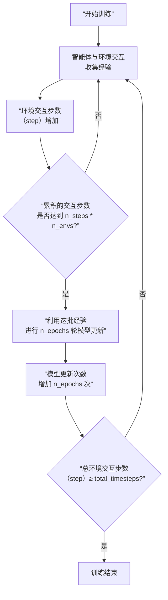

# tensorboard

本文旨在说明记录在tensorboard中的各种指标的含义。

[TOC]

## Horizontal axis

在基于 Stable-Baselines3 (SB3) 这类库的强化学习训练中，TensorBoard 日志的横坐标 `step` 具有**特定且统一的含义**。

### 核心定义

横坐标 **`step`** 的普遍性含义是：**智能体与环境进行交互的总次数**，也称为**环境步数**或**样本步数**。

您可以将其理解为智能体在训练过程中所积累的**总经验量**。每一次交互（一个 `step`）都遵循“观察状态 -> 选择动作 -> 执行动作 -> 获得奖励”的基本循环。

### 与相关概念的关系

为了更清晰地展示 `step` 在PPO训练流程中的位置及其与相关概念的关系，特别是与**模型更新次数**的区别，请参考下面的流程图：

结合上图，我们来厘清几个关键概念：

1.  **`step`（横坐标） vs. 模型更新次数**：
    *   **`step`（环境交互步数）**：这是**数据生产的量度**。如流程图所示，它随着智能体与环境的每一次交互而增加，是训练进度的**主时间轴**。
    *   **模型更新次数**：这是**学习发生次数的量度**。它位于流程图的右下部分，只有在积累足够经验后才会进行。它的计算方式为：
        `模型更新次数 ≈ (总环境交互步数 step) / (n_steps * n_envs) * n_epochs`

2.  **`step` 与超参数 `total_timesteps`**：
    *   `total_timesteps` 是您设置的**训练总预算**，它定义了训练过程的总规模。
    *   横坐标 `step` 从 0 开始，记录了这个预算的**消耗进度**。
    *   当 `step` 增长到等于 `total_timesteps` 时，训练便会终止。因此，**`total_timesteps` 决定了横坐标 `step` 的最大值**。

### 为什么选择环境交互步数作为横坐标？

这是因为环境交互步数是一个**稳定、统一的基准**，不受算法内部更新策略的干扰。

*   **便于比较**：无论您如何设置 `n_envs`、`n_steps` 或 `n_epochs`，一个在 100 万环境步数下表现良好的算法，其性能可以直接与另一个在 100 万环境步数下的算法进行比较。如果使用“模型更新次数”作为横坐标，这种比较就会因超参数设置不同而失去意义。
*   **直观反映数据量**：它直接回答了“智能体总共见识过多少情况？”这一基本问题。

## eval

评估并不是每一步都进行，每进行eval_freq个训练步，就暂停训练，进行一次评估。评估回合数由n_eval_episodes决定。

### mean_ep_length

#### 核心定义

`eval/mean_ep_length` 是一个在**评估模式**下计算的指标，其含义是：**智能体在多个评估回合中，完成每个回合所需的平均步数。**

让我们来拆解这个名称：
*   **`eval`**： 代表 **评估**。这意味着这个指标是在一个独立的、用于测试的环境中计算的。在此模式下，智能体的策略通常是**确定性的**（例如，直接选择概率最高的动作，而非随机采样），并且不进行探索。这能更好地反映智能体的**真实性能**，而非其探索能力。
*   **`ep_length`**： 是 **Episode Length** 的缩写，指一个**回合的长度**，即从回合开始到结束所经历的时间步数量。
*   **`mean`**： 代表 **平均值**。即对多个评估回合的长度取平均，以得到一个稳定、有代表性的统计量。

#### 这个指标能告诉我们什么？

`mean_ep_length` 是衡量智能体**策略效率**和**任务难度**的一个重要间接指标。

1.  **策略效率的体现**：
    *   **`mean_ep_length` 值降低**：在大多数任务中，这通常是一个**积极的信号**。它表明智能体正变得越来越**高效**，能够用更少的步骤完成任务。
    *   **`mean_ep_length` 值稳定在一个较低水平**：通常意味着策略已经收敛，并且是高效的。

2.  **任务难度与性质的反映**：
    *   这个指标本身的大小也反映了任务的特性。一个需要复杂、多步决策才能解决的任务，其平均回合长度自然会比一个简单任务长。
    *   需要注意的是，**回合长度并非越短越好**。在某些奖励设计中，过早结束回合可能意味着失败（比如智能体撞墙导致游戏结束）。因此，必须结合 **`eval/mean_reward`（平均回报）** 这个核心指标一起看。最理想的情况是：**平均回报持续上升，同时平均回合长度稳定或下降**。这证明智能体不仅获得了高回报，而且是用一种更高效的方式实现的。

#### 在训练过程中的变化与解读

在 TensorBoard 中观察这个指标随训练步数的变化趋势，比看单个数值更有意义：

*   **趋势下降**：如果随着训练，`mean_ep_length` 呈现**下降趋势**并最终稳定，这强烈表明智能体正在学习如何**更快、更高效地解决问题**。这是学习有效的直接证据。
*   **趋势上升或剧烈波动**：如果该指标上升或大幅波动，可能意味着：
    *   智能体在学习过程中遇到了困难，策略不稳定。
    *   任务本身有多个阶段或需要“绕远路”才能获得更高奖励。
    *   需要结合奖励曲线来判断——如果回报也在上升，那么回合变长可能是策略为了追求更大奖励而采取的合理行为。

### mean_reward

`eval/mean_reward`是强化学习训练中**最核心的性能评估指标**，它衡量的是智能体在测试环境中的**平均表现水平**。

####  核心定义

`eval/mean_reward`表示智能体在**评估模式**下，运行多个完整回合后获得的**平均累积奖励**。

- **`eval`（评估）**：意味着这是在独立的测试环境中进行的，智能体使用**确定性策略**（通常选择最优动作，而非随机探索），目的是客观评估当前策略的真实水平。
- **`mean`（平均）**：对多个评估回合（例如5次）的结果取平均值，以减少单次运行的随机性，得到更稳定、可靠的统计量。
- **`reward`（奖励）**：是环境根据智能体的行为给出的反馈信号，是任务目标的量化体现。

#### 这个指标为什么如此重要？

**`eval/mean_reward`是判断智能体是否真正“学会”了任务的最直接证据。**

1. **策略性能的终极衡量标准**： 这个指标的**上升趋势**直接表明智能体的策略正在不断改进，越来越擅长完成任务。 训练的目标就是最大化这个值。
2. **训练过程的“晴雨表”**： **持续稳定上升**：表明训练健康，学习有效。 **剧烈波动或下降**：可能意味着训练不稳定、策略崩溃或超参数设置不当。 **长时间平台期**：可能表示策略已收敛到局部最优，或遇到了学习瓶颈。

#### 如何正确解读？

观察这个指标时，需要关注其**趋势和稳定性**，而不仅仅是某个时间点的绝对值。

- **与训练奖励对比**：通常，`eval/mean_reward`会低于训练时的平均奖励，因为训练模式包含探索（更随机），而评估模式是纯利用（确定性策略）。但如果两者差距过大，可能说明策略过拟合了训练时的探索噪声。
- **结合其他指标**：需与 `eval/mean_ep_length`（平均回合长度）等指标结合分析。最理想的情况是：**平均奖励持续上升，同时平均回合长度稳定或下降**，这证明智能体在用更高效的方式获得更高回报。

## rollout

### ep_len_mean

`rollout/ep_len_mean` 是强化学习训练中一个重要的监控指标，它衡量的是**在训练数据收集阶段，每个并行环境运行的平均回合长度**。

#### 核心定义

*   **`rollout`（数据收集/ rollout）**：指代PPO算法中**收集经验数据的阶段**。在此阶段，智能体使用**当前策略**（包含探索，如ε-greedy或随机采样）在多个并行环境中交互，以生成用于训练模型的经验数据。
*   **`ep_len`（Episode Length）**：指一个**回合的长度**，即从初始状态开始，到回合终止（如任务成功、失败或达到最大步数限制）所经历的时间步总数。
*   **`mean`（平均值）**：对所有并行环境在本次数据收集阶段内完成的回合长度取平均值。

#### 与 `eval/mean_ep_length` 的关键区别

虽然两者都衡量回合长度，但它们的计算场景和目的有本质不同，理解这点至关重要：

| 特征         | **`rollout/ep_len_mean`（训练数据收集）**        | **`eval/mean_ep_length`（性能评估）**                |
| :----------- | :----------------------------------------------- | :--------------------------------------------------- |
| **策略模式** | **带探索的训练策略**（随机性，如动作采样）       | **确定性策略**（通常取最大概率动作，无探索）         |
| **目的**     | 监控**训练过程**的数据分布和探索行为             | 评估**最终策略**的性能和效率                         |
| **反映内容** | 智能体**如何探索环境**，当前策略的**行为模式**   | 智能体**如何利用知识**，**优化后策略**的**真实水平** |
| **稳定性**   | 波动可能较大，因为策略在持续更新，且包含随机探索 | 相对更平滑、稳定，反映的是策略的“考试”水平           |

#### 如何解读 `rollout/ep_len_mean`？

观察这个指标的趋势，可以洞察训练的动态过程：

1.  **下降趋势**：在大多数任务中，如果平均回合长度随着训练而**缩短**，通常是一个好迹象。它表明智能体正在学习如何**更高效地完成任务**，或者更快地达到目标。例如，在导航任务中，这可能意味着智能体找到了更短的路径。

2.  **上升或波动**：如果回合长度增加或剧烈波动，可能意味着：
    *   **探索增强**：智能体正在尝试新的、更复杂的行为序列。
    *   **策略变化**：策略更新导致行为模式改变。
    *   **任务难度**：任务本身可能需要多步决策，智能体正在学习更复杂的技能。

3.  **与奖励结合分析**：**最关键的是将 `rollout/ep_len_mean` 与 `rollout/ep_rew_mean`（训练平均奖励）结合观察。**
    *   **理想情况**：奖励**上升**，同时回合长度**稳定或下降**。这表明智能体正在用更高效的方式获得更高回报。
    *   **需警惕情况**：奖励**下降**，同时回合长度**显著缩短**。这可能意味着智能体学会了一种“作弊”方式，通过快速失败来结束回合，从而避免在任务中获得更低的负奖励（**智能体“躺平”了**）。

### ep_rew_mean

`rollout/ep_rew_mean` 是强化学习训练中**最直接的性能监控指标**，它衡量的是智能体在**训练数据收集阶段获得的平均回报**。

#### 核心定义

*   **`rollout`（数据收集）**：指PPO算法中智能体使用**当前策略**与环境交互以**收集训练经验**的阶段。在此阶段，策略通常包含探索行为（如随机采样动作）。
*   **`ep_rew_mean`（Episode Reward Mean）**：即**平均回合奖励**。它表示在本次数据收集过程中，智能体在**每个完整回合**里所获得的**累积折扣奖励的平均值**。

#### 这个指标告诉我们什么？

**`rollout/ep_rew_mean` 直观反映了当前训练策略在环境中的“即时表现”有多好。**

*   **上升趋势**：如果这个值随着训练步数增加而呈现**稳定上升趋势**，这是最理想的信号。它明确表示智能体正在学习如何获得更高的回报，即策略在**持续改进**。
*   **波动或下降**：如果曲线剧烈波动或下降，可能意味着：
    *   训练不稳定（如学习率过高、批次大小不合适）。
    *   策略正在探索新的、可能暂时无效的行为。
    *   智能体正处于忘记旧技能、学习新技能的“平台期”。

#### 关键洞察：与评估指标对比

理解 `rollout/ep_rew_mean` 的真正价值，需要将其与 **`eval/mean_reward`** 结合分析：

| 指标                      | 计算场景         | 策略行为             | 主要作用                             |
| :------------------------ | :--------------- | :------------------- | :----------------------------------- |
| **`rollout/ep_rew_mean`** | **训练数据收集** | **带探索**（随机性） | 监控**训练过程的动态**和**探索效果** |
| **`eval/mean_reward`**    | **性能评估**     | **确定性**（无探索） | 评估策略的**最终真实性能**           |

*   **正常情况下**：`eval/mean_reward` 会高于 `rollout/ep_rew_mean`，因为评估时策略是确定性的，能更稳定地执行最优动作。
*   **重要信号**：如果 `rollout/ep_rew_mean` 持续显著高于 `eval/mean_reward`，可能意味着智能体**过度依赖探索时的随机性**，其确定性策略（实际应用的策略）本身性能并不好。这是一种**过拟合训练数据噪声**的表现。

## time

### fps

`time/fps` 是强化学习训练中一个重要的**性能效率指标**，它衡量的是训练过程的**计算吞吐量**。

#### 核心定义

*   **FPS**：是 **Frames Per Second** 的缩写，直译为“每秒帧数”。
*   **在强化学习语境下**：这里的“帧”通常等同于智能体与环境的**一次交互**，即一个**时间步**。
*   **因此，`time/fps` 的含义是：训练过程中，整个系统每秒能处理的环境交互步数。**

#### 这个指标为什么重要？

**`fps` 直接反映了训练系统的效率和速度，是评估训练设置合理性的关键指标。**

1.  **训练速度的直观体现**：
    *   **较高的 fps 值**（如几千以上）表示训练速度很快，智能体每秒能获得大量经验。
    *   **较低的 fps 值**（如几百或几十）表示训练速度缓慢，可能需要检查是否存在性能瓶颈。

2.  **识别性能瓶颈**：通过观察 fps 的变化，可以帮助诊断问题：
    *   如果 fps **异常偏低**，可能原因包括：环境模拟本身计算昂贵、神经网络模型过于复杂、硬件资源（CPU/GPU）不足或未被充分利用、数据传递存在瓶颈等。
    *   在您的配置中，`n_envs: 4` 表示使用了4个并行环境，理想情况下这应该能显著提升 fps（即每秒能并行处理4个环境的前向传播和交互）。

#### 如何解读 fps 值？

fps 的值本身没有绝对的“好”或“坏”，它高度依赖于具体任务和环境。

*   **与环境复杂度相关**：一个简单的网格世界环境可能达到数万 fps，而一个复杂的 3D 物理仿真环境可能只有几十 fps。
*   **与硬件相关**：使用 GPU 加速神经网络计算通常能大幅提升 fps。
*   **监控趋势**：在训练过程中，fps 值应该保持相对稳定。如果 fps 随着训练进行而**显著下降**，可能表明系统出现了内存泄漏或其他资源问题。

## train

### approx_kl

`train/approx_kl` 是 PPO 算法中一个至关重要的**诊断性指标**，它直接反映了策略更新的**稳定性**。其全称是 **近似KL散度**。

#### 核心定义：KL散度

要理解这个指标，首先要明白什么是 **KL散度**。它是一个来自信息论的概念，用于衡量两个概率分布之间的**差异**或“距离”。

在PPO的语境下，这两个概率分布分别是：
1.  **旧策略（π_old）**：在本次更新周期开始前，用于收集经验数据的策略。
2.  **新策略（π_new）**：正在被优化器更新的、新的策略。

因此，**`train/approx_kl` 衡量的是新策略相对于旧策略发生了多大的变化。**

#### 为什么这个指标至关重要？

这源于PPO的核心思想：**近端策略优化**。PPO希望新策略的更新是“温和”的，不要偏离旧策略太远。KL散度就是量化这种“偏离程度”的数学工具。

*   **`approx_kl` 值过小**：意味着新策略和旧策略几乎一模一样。这虽然安全，但也表明**策略更新可能过于保守**，学习进度非常缓慢。
*   **`approx_kl` 值在合理范围内**：这表明策略正在以**稳定且有效**的速度学习和改进。这是最理想的状态。
*   **`approx_kl` 值突然飙升**：这是一个**危险信号**！它意味着单次更新导致策略发生了**剧烈变化**。这通常会导致策略性能崩溃（奖励曲线断崖式下跌），因为新策略已经脱离了旧策略的“信任区域”，基于旧数据进行的更新变得不可靠。

#### 与 `clip_range` 的关系

`train/approx_kl` 与另一个关键超参数 **`clip_range`**紧密相关。

PPO的Clip机制的目标就是**主动限制**KL散度的增长。您可以这样理解它们的关系：
*   **`clip_range` 是“目标”或“约束”**：它设定了允许策略变化的上限。
*   **`approx_kl` 是“实际结果”**：它显示了策略变化的实际大小。

在训练过程中，如果 `approx_kl` 远小于 `clip_range`（例如 `approx_kl` 在0.05而 `clip_range` 是0.2），说明Clip机制没有生效，更新是自然的。如果 `approx_kl` 接近或达到 `clip_range`，说明Clip机制正在发挥作用，阻止了更大的更新。

### clip_fraction

`train/clip_fraction` 是 PPO 算法中一个重要的**诊断性指标**，它直观地反映了 PPO 核心的**裁剪机制在实际更新过程中的激活频率**。

#### 核心定义

*   **`clip`（裁剪）**：指的是 PPO 算法中用于限制策略更新步长的**裁剪机制**。
*   **`fraction`（比例）**：表示一个部分占总体的比率。

因此，**`train/clip_fraction` 的含义是：在最近一次模型更新中，有多少比例的经验数据（状态-动作对）触发了 PPO 的裁剪机制。**

#### 工作原理：什么情况下会被“裁剪”？

要理解这个指标，我们需要回顾 PPO 的损失函数。PPO 会计算一个新策略与旧策略的概率比 `ratio`：

*   `ratio` > 1：表示新策略更倾向于该动作。
*   `ratio` < 1：表示新策略不太倾向于该动作。

PPO 的 `clip_range` 参数（例如 0.2）定义了一个信任区域 `[1 - ε, 1 + ε]`（例如 `[0.8, 1.2]`）。

**当 `ratio` 的值落在这个区间之外时，就会被裁剪机制所限制。** 具体来说：
*   当动作的优势值为正（好动作）时，如果 `ratio` **大于** `1 + ε`，则会被裁剪。
*   当动作的优势值为负（坏动作）时，如果 `ratio` **小于** `1 - ε`，则会被裁剪。

**`clip_fraction` 统计的就是这批训练数据中，满足上述裁剪条件的样本所占的百分比。**

#### 如何解读这个指标？

`clip_fraction` 的值提供了关于训练稳定性和更新强度的关键信息。

| `clip_fraction` 取值                   | 含义与解读                                                   |
| :------------------------------------- | :----------------------------------------------------------- |
| **接近 0%**                            | 意味着几乎没有数据被裁剪。这表明策略更新非常**温和**，新策略与旧策略非常接近。这可能是因为学习率设置得过低，或者策略已经收敛。 |
| **在一个适中的比例（例如 10% - 30%）** | 这是一个**比较健康**的信号。它表明裁剪机制在适度地发挥作用，既防止了策略的剧烈变化，保证了稳定性，又允许策略进行有效的更新。 |
| **比例过高（例如 > 50%）**             | 这是一个**警告信号**。它表明有大量数据的策略更新幅度都达到了裁剪边界。这通常意味着： 1. **学习率可能太高**，导致优化器试图一次性过大地更新策略。 2. **当前批次的经验数据已经“过时”**，因为策略在多次 `n_epochs` 更新后已经变得与收集数据时的旧策略差异很大。这可能导致训练不稳定。 |

### 与其他指标的关系

*   **与 `clip_range`**：`clip_fraction` 直接受到 `clip_range` 的影响。缩小 `clip_range`（使信任区域更窄）通常会提高 `clip_fraction`，因为更多的 `ratio` 会落在区间外。
*   **与 `train/approx_kl`**：`clip_fraction` 飙升时，`approx_kl`（近似KL散度）通常也会显著增大，两者都是训练可能不稳定的重要征兆。

### clip_range

含义已经在approx_kl、clip_fraction以及超参数环节介绍过，此处不再赘述。

### entropy_loss

`train/entropy_loss` 是 PPO 算法中一个关键的**辅助优化指标**，它直接反映了智能体**策略的随机性（或探索性）在训练过程中的变化**。

#### 核心定义：什么是“熵”？

在信息论中，**熵**是衡量一个系统**不确定性**或**混乱程度**的指标。在强化学习中，策略的熵衡量的是智能体在给定状态下选择动作的**随机性**。

*   **高熵策略**：智能体的行为非常随机，探索性很强。例如，在有4个动作的状态下，策略概率分布为 `[0.25, 0.25, 0.25, 0.25]`（每个动作概率均等），此时熵值最高。
*   **低熵策略**：智能体的行为非常确定，利用性很强。例如，策略概率分布为 `[0.9, 0.05, 0.03, 0.02]`，此时熵值很低。

#### `entropy_loss` 的作用机制

在 PPO 的总损失函数中，`entropy_loss` 是一项重要的组成部分：

`Total Loss = Policy Loss + Value Loss - entropy_coef * Entropy`

请注意这里的**负号**：由于优化器通常执行**最小化**损失函数，而减去熵项实际上意味着我们要**最大化策略的熵**。

因此，`train/entropy_loss` 指标（在代码中通常是 `-entropy_coef * Entropy` 这部分的值）的**下降**，实际上对应着策略熵的**增加**。反之，该指标的上升则意味着策略熵的减少。

#### 如何解读 `entropy_loss` 的曲线？

观察 `train/entropy_loss` 的趋势，可以洞察智能体的探索行为如何随时间演变：

1.  **曲线逐渐上升（熵在减少）**：
    *   **这是最常见且健康的现象**。它表明智能体正在从**广泛探索**转向**专注利用**。随着训练进行，智能体逐渐发现了哪些动作能带来高回报，因此其策略变得越来越确定，熵自然下降。
    *   这通常伴随着 `eval/mean_reward` 的上升，说明智能体正在“学有所成”。

2.  **曲线下降或保持在较高水平（熵在增加或维持）**：
    *   这可能意味着智能体仍在积极探索，或者策略尚未收敛。
    *   如果伴随奖励不上升，可能表明智能体未能从探索中学到有效策略，陷入了随机行为。

3.  **曲线过早地急剧上升（熵过快减少）**：
    *   这是一个**警告信号**。它表明智能体可能过早地“固执己见”，收敛到一个**局部最优解**，而不再探索可能更好的动作。这通常是由于 `ent_coef`（熵系数）设置得过小，导致对探索的鼓励不足。

#### 与 `ent_coef` 超参数的关系

配置中的 `ent_coef:` 是一个**权重系数**，它控制了“最大化熵”这个目标在总损失中的相对重要性。

*   **`ent_coef` 较大**：会更强力地鼓励探索，可能导致 `entropy_loss` 维持在较低水平（即熵保持较高），学习速度变慢，但有助于避免局部最优。
*   **`ent_coef` 较小**：对探索的鼓励较弱，策略会更快地变得确定（`entropy_loss` 快速上升），可能收敛更快，但过早收敛的风险增加。

### explained_variance

`train/explained_variance`是一个重要的**诊断性指标**，它直接评估了**价值网络（Critic）的预测有多准确**。你可以把它理解为价值网络预测能力的“**考试成绩**”或“**确定系数**”。

#### 核心定义

- **`explained_variance`**：中文可译为“**可解释方差**”或“**决定系数**”。它衡量的是一个预测模型（在这里是价值网络）能够解释目标数据（在这里是实际的回报）的方差的比例。
- **在PPO中的具体计算**：它的计算基于价值网络的预测值（`V(s)`）和实际观察到的回报目标（`TD Target`或 `Return`）。 `explained_variance = 1 - [Variance(实际目标 - 预测值) / Variance(实际目标)]`

#### 这个指标告诉我们什么？

**`train/explained_variance`直观地反映了价值网络（Critic）对状态价值的预测质量。**

这个指标的值域在 `-∞`到 `1`之间：

- **`explained_variance = 1`（理想情况）**： 这意味着价值网络的预测**完美无缺**。预测值 `V(s)`和实际目标值之间完全没有误差，价值网络能够100%地解释实际回报的波动。在实际训练中这几乎不可能达到。
- **`explained_variance`接近 1（例如 > 0.8）**： 这是一个**非常积极的信号**。表明价值网络做出了**高度准确**的预测。策略网络（Actor）可以充分信任这个“评论家”给出的评分，从而进行稳定有效的更新。
- **`explained_variance`值较低（例如 < 0.5）或为负值**： 这是一个**警告信号**。 
  - **值较低**：表明价值网络的预测不准确，有很大的误差。这就像是一个不可靠的评论家，其给出的建议会误导策略网络的更新方向。
  -  **值为负**：这意味着价值网络的预测**比直接使用目标值的平均值作为预测还要差**。这通常发生在训练初期或价值网络训练非常不稳定的情况下。

#### 为什么这个指标很重要？

价值网络在PPO中扮演着“**引导者**”的角色。优势函数 `A(s, a) = 实际回报 - V(s)`的计算严重依赖于价值网络的预测 `V(s)`。

1. **策略更新的指南针**：一个准确的价值网络能计算出可靠的优势函数，从而告诉策略网络“哪个动作更好，哪个动作更差”。如果这个指南针失灵（`explained_variance`低），策略更新就会迷失方向。
2. **训练稳定性的基石**：PPO的稳定性很大程度上依赖于低方差的价值估计。一个高 `explained_variance`意味着价值估计的方差低，这为策略的稳定优化奠定了基础。

### learning_rate

学习率，不过多赘述。

### policy_gradient_loss

`train/policy_gradient_loss` 是PPO算法中策略网络（Actor）损失函数的核心组成部分，它直接衡量了**策略梯度更新信号的大小**，反映了策略网络在每次更新时，其参数调整的**方向和幅度**，以最大化期望累积奖励。

#### 核心定义
- **策略梯度（Policy Gradient）**：是强化学习中的一种基本方法，它通过计算期望回报对策略参数的梯度，来指导策略的优化方向。简单来说，它回答了“如何微调策略参数，才能让智能体获得更多奖励？”这个问题。
- **在PPO中的角色**：在PPO算法中，`policy_gradient_loss` 是策略优化目标的具体实现。它基于**优势函数**（Advantage Function），该函数量化了在特定状态下采取某个动作相对于平均水平的“好坏程度”。

#### 工作机制
PPO的策略损失函数通常包含裁剪机制，其一般形式为：
\[ L^{CLIP} = \mathbb{E} \left[ \min\left( ratio \times A_t, \text{clip}(ratio, 1-\epsilon, 1+\epsilon) \times A_t \right) \right] \]
其中：
- \( ratio = \frac{\pi_{\text{new}}(a|s)}{\pi_{\text{old}}(a|s)} \) 是新旧策略的概率比。
- \( A_t \) 是优势函数，估计动作的相对价值。
- `policy_gradient_loss` 通常是上述损失函数的计算值（或其变体），其**目标是最大化**这个裁剪后的替代目标。

**直观理解**：这个损失函数鼓励智能体：

- 增加那些能带来**正优势**（好于平均水平）的动作的概率。
- 减少那些带来**负优势**（差于平均水平）的动作的概率。
- 同时，通过裁剪机制，确保每次更新的步长不会太大，避免策略突变。

#### 监控这个指标的意义
- **损失值下降**：通常表示策略正在沿着提升性能的方向稳定更新。但需注意，由于目标是最大化（在代码中常转化为最小化负值），损失值的降低往往对应着策略性能的改进。
- **损失值剧烈波动**：可能意味着训练不稳定（如优势估计不准、学习率过高），或策略正在探索新的行为模式。
- **与其他指标关联**：需结合 `eval/mean_reward` 等评估指标来看。如果策略梯度损失下降但评估奖励未提升，可能表明策略过拟合了训练数据，或价值函数估计不准误导了策略更新。

#### 在训练中的典型行为
- **训练初期**：损失可能较大且波动，因为策略和价值函数都在初步学习阶段，优势估计不准确。
- **训练中期**：随着价值函数变得更准确，优势估计更可靠，损失值通常会呈现稳定下降趋势，表明策略在持续改进。
- **收敛期**：损失值可能趋于一个稳定值，表明策略已接近局部最优，更新幅度变小。

### value_loss

`train/value_loss` 是 PPO 算法中一个至关重要的**诊断性指标**，它专门用来衡量**价值网络（Critic）的预测准确度**。你可以将其理解为价值网络在“开卷考试”中的“**错题率**”。

#### 核心定义与计算方式

*   **价值网络（Critic）的角色**：价值网络是 PPO 算法中的“评论家”。它的任务是**评估**在给定状态下，遵循当前策略所能获得的**期望累积回报（即状态价值 V(s)）**。这个评估值是计算**优势函数 A(s, a)** 的基础，而优势函数直接指导着策略网络（Actor）的更新方向。

*   **`value_loss` 的计算**：`value_loss` 是价值网络预测值 `V_predicted` 与一个我们认为是“真实值”的目标 `V_target` 之间的差异。在 PPO 中，这个目标通常采用**时序差分目标**：
    `V_target = r + γ * V(s')`
    其中 `r` 是即时奖励，`γ` 是折扣因子，`V(s')` 是下一个状态的预测价值。

    最常用的损失函数是**均方误差**：
    `value_loss = MSE(V_predicted, V_target) = (V_predicted - V_target)^2` 的平均值。

**简单来说，`value_loss` 回答了这个问题：我们价值网络做出的预测，离我们认定的“真相”有多远？**

#### 这个指标为什么如此重要？

**`value_loss` 是判断价值网络是否称职的“健康检查表”。** 一个准确的价值网络是 PPO 稳定训练的基石。

1.  **策略更新的指南针**：策略网络依靠优势函数 `A(s, a) = V_target - V_predicted` 来决定如何更新。如果价值网络的预测 `V_predicted` 不准确（`value_loss` 很高），那么计算出的优势函数就是错误的，相当于给策略网络指了一个错误的方向，导致策略更新混乱甚至崩溃。

2.  **训练稳定性的晴雨表**：
    *   **`value_loss` 持续下降并稳定在较低值**：这是**最理想**的情况。它表明价值网络正在学习如何准确评估状态，策略网络可以信赖其给出的信号。训练过程很可能是稳定的。
    *   **`value_loss` 剧烈波动或居高不下**：这是一个**危险信号**。这表明价值网络无法理解环境，或者训练非常不稳定。这通常会直接导致策略性能的剧烈波动（奖励曲线大起大落）。

#### 如何解读其变化趋势？

*   **训练初期**：`value_loss` 通常较高且波动较大。这是因为价值网络是随机初始化的，对环境的回报模式一无所知，预测误差自然很大。同时，策略的快速变化也使得价值目标 `V_target` 本身很不稳定。
*   **训练中期**：随着智能体收集到更多经验，价值网络会逐渐学习到环境的内在规律。此时，`value_loss` 应该呈现出**明显的下降趋势**并逐渐收敛到一个较低的稳定值。
*   **训练后期**：当策略和价值函数都收敛时，`value_loss` 会稳定在一个较低的数值附近小幅波动。

#### 与其他指标和超参数的关系

*   **与 `train/explained_variance`**：这两个指标是同一枚硬币的两面。`explained_variance` 衡量的是预测的“准确性”，而 `value_loss` 衡量的是“不准确性”。一个低的 `value_loss` 通常对应着一个高的 `explained_variance`。
*   **与 `vf_coef`**：`vf_coef` 超参数决定了 `value_loss` 在总损失函数中的权重。如果 `value_loss` 长期很大，可以尝试适当增大 `vf_coef`，让优化过程更侧重于优化价值网络。
*   **与学习率**：过高的学习率可能导致 `value_loss` 震荡不降；过低的学习率则可能导致 `value_loss` 下降得过于缓慢。

### loss

`train/loss` 是 PPO 训练过程中**被优化器直接最小化的总目标函数**。

#### 核心定义：总损失的构成

在 PPO 算法中，`train/loss` 并非一个单一的损失，而是由三个核心部分按一定权重加权组合而成，其普遍形式的计算公式如下：

`loss = policy_gradient_loss - ent_coef * entropy_loss + vf_coef * value_loss`

让我们来逐一分解这三个组成部分：

1.  **策略损失 - `policy_gradient_loss`**
    *   **角色**：**主攻手**。这是 PPO 的核心，直接负责**改进策略**。它的目标是最大化期望累积奖励。它通过 PPO-Clip 机制确保更新是稳定、小幅度的。
    *   **目标**：**最大化**。因此在总损失中，它是被**最小化的负值**（即 `- (用于最大化的目标)`）。

2.  **价值损失 - `value_loss`**
    *   **角色**：**侦察兵**。它负责训练价值网络（Critic），使其能**准确评估状态的价值**。通常采用均方误差（MSE）计算。
    *   **目标**：**最小化**预测误差。因此它在总损失中是**正值**。
    *   **权重**：由 `vf_coef`控制。这个系数决定了优化过程在“优化策略”和“训练价值网络”之间分配的注意力。

3.  **熵奖励 - `entropy_loss`**
    *   **角色**：**探索鼓励官**。它实际上是**负的熵项**。它的作用是**鼓励策略保持一定的随机性**，防止其过早收敛到局部最优解而停止探索。
    *   **目标**：**最大化**策略的熵（即随机性）。因此在总损失中，它是 **`- ent_coef * entropy_loss`**。
    *   **权重**：由 `ent_coef`控制。这个系数平衡了“利用已知好动作”和“探索新动作”之间的关系。

#### 如何解读 `train/loss` 曲线？

由于 `train/loss` 是三个目标的加权和，直接解读其绝对值的意义不大。更重要的是观察其**相对变化趋势**，并将其与三个子损失的变化联系起来分析。

*   **持续下降**：通常表明优化过程正在稳步进行，总目标函数正在被最小化。但需结合子损失判断下降主要由哪部分驱动。
*   **剧烈波动**：往往意味着训练不稳定。可能的原因包括：
    *   `value_loss` 突然飙升（价值网络预测不准）。
    *   `policy_gradient_loss` 因策略突变而剧烈变化。
*   **平台期**：可能表示策略接近收敛，或者遇到了学习瓶颈。

#### 诊断训练问题的关键

当 `train/loss` 出现异常时，**必须**查看其三个子成分才能准确诊断问题：

*   如果总损失上升主要是由 `value_loss` 急剧上升引起的，说明价值网络学习出现了问题。
*   如果总损失变化平稳，但 `eval/mean_reward` 不增长，可能是 `policy_gradient_loss` 的优化被其他项（尤其是较大的 `value_loss`）所主导，策略本身改进缓慢。

